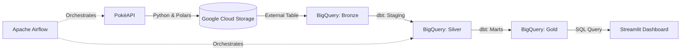

# Modern Pokémon Data Pipeline (ELT)

[](https://www.python.org/)
[](https://airflow.apache.org/)
[](https://www.getdbt.com/)
[](https://cloud.google.com/)
[](https://streamlit.io/)

A production-grade, cloud-native **ELT (Extract, Load, Transform)** data pipeline featuring automated orchestration with Apache Airflow, scalable cloud storage in GCS, robust data transformation with dbt in BigQuery, and interactive analytics with Streamlit.

---

## 🏗️ Architecture Overview

This pipeline follows the **Medallion Architecture** (Bronze, Silver, Gold) to ensure data quality, scalability, and decoupled design.



### 🏅 The Medallion Layers
*   **🥉 Bronze (Raw):** Raw JSON data extracted from the API and saved as partitioned `.parquet` files in Google Cloud Storage (GCS).
*   **🥈 Silver (Staging):** Cleaned, typed, and standardized data. Handled by dbt `stg_` models reading directly from the GCS External Table.
*   **🥇 Gold (Marts):** Business-ready, modeled data following a Star Schema (`dim_pokemon`, `fct_pokemon_stats`), optimized for fast querying by the BI layer.

---

## 🛠️ Tech Stack

| Category | Technologies |
| :--- | :--- |
| **Language & Core** | Python 3.11+, Polars, Requests |
| **Orchestration** | Apache Airflow (Dockerized) |
| **Cloud Infrastructure** | Google Cloud Platform (GCS, BigQuery) |
| **Transformation & Quality** | dbt (Data Build Tool), Jinja SQL |
| **Visualization** | Streamlit, Pandas |
| **Package Management** | uv (Ultra-fast Python package installer) |

---

## ✨ Key Features & Senior Best Practices

*   **Decoupled Architecture:** Python handles extraction and GCS loading only. Heavy transformations are delegated to BigQuery via dbt, preventing memory bottlenecks in Airflow.
*   **Zero-Copy Data Ingestion:** Utilizes BigQuery External Tables to query Parquet files directly from GCS without duplicating storage.
*   **Data Quality Contracts:** Implements dbt generic and singular tests (`unique`, `not_null`, `relationships`, `accepted_values`) to prevent bad data from reaching the dashboard.
*   **Infrastructure as Code (IaC):** Fully containerized Airflow environment using `docker-compose`, ensuring reproducibility across local and cloud environments.
*   **DRY Principle:** Custom dbt macros (e.g., `cast_with_default`) to eliminate repetitive SQL code and ensure consistency.

---

## 📂 Project Structure

```text
pokemon-pipeline/
├── dags/                    # Apache Airflow DAG definitions
├── dbt_project/             # dbt project for BigQuery transformations
│   ├── pokemon_dbt/
│   │   ├── models/
│   │   │   ├── staging/     # Silver layer
│   │   │   └── marts/       # Gold layer (Star Schema)
│   │   ├── tests/           # Custom data quality tests
│   │   ├── macros/          # Reusable Jinja/SQL functions
│   │   ├── dbt_project.yml
│   │   └── profiles.yml
├── scripts/                 # Python extraction and GCS loading scripts
├── streamlit_app.py         # Interactive analytics dashboard
├── docker-compose.yml       # Airflow orchestration setup
├── pyproject.toml           # Project dependencies (managed by uv)
└── README.md
```

---

## 🚀 Getting Started

### Prerequisites
*   Docker & Docker Compose
*   Python 3.11+ with `uv` installed
*   A Google Cloud Platform (GCP) account with a project, BigQuery dataset, and GCS bucket
*   A GCP Service Account JSON key (`gcp_credentials.json`) with **BigQuery Admin** and **Storage Admin** roles

### 1. Environment Setup
Clone the repository and install dependencies:
```bash
git clone https://github.com/DavidSerranoFranco/pokemon-data-pipeline.git
cd pokemon-pipeline
uv sync
```

### 2. Configure Environment Variables
Set your GCP credentials and project details:
```bash
export GOOGLE_APPLICATION_CREDENTIALS="/path/to/your/gcp_credentials.json"
export GCP_PROJECT_ID="your-gcp-project-id"
export GCS_BUCKET="your-gcs-bucket-name"
export ENVIRONMENT="production"
```

### 3. Run the Pipeline
Start the Airflow environment:
```bash
docker-compose up -d
```
Navigate to `http://localhost:8080` (User: `airflow`, Password: `airflow`), trigger the `pokemon_elt_pipeline` DAG, and watch the magic happen.

### 4. Launch the Dashboard
Once the pipeline completes successfully, run the Streamlit app:
```bash
uv run streamlit run streamlit_app.py
```
Open `http://localhost:8501` to explore the interactive Pokémon analytics dashboard, or view the live deployment below:

[](https://pokemon-data-pipeline-yjj7vxsspimdh3zghrixvs.streamlit.app/)

📊 **[Explore My Live Analytics Dashboard Here](https://pokemon-data-pipeline-yjj7vxsspimdh3zghrixvs.streamlit.app/)**

---

## 🔮 Future Enhancements
*   Implement dbt incremental models for efficient daily updates.
*   Add CI/CD pipelines (GitHub Actions) to run `dbt test` on pull requests.
*   Expand the API extraction to include battle stats, moves, and evolution chains.
*   Deploy the Streamlit app to Streamlit Cloud or Google Cloud Run.

---

<br>
<p align="center">
  <i>Engineered with precision, scalability, and a passion for data. ⚡</i>
</p>

<p align="center">
  <a href="https://www.linkedin.com/in/david-serrano-franco-77805025b">
    
  </a>
</p>

<p align="center">
  <strong>David Serrano Franco</strong> • Senior Data Engineer
</p>
